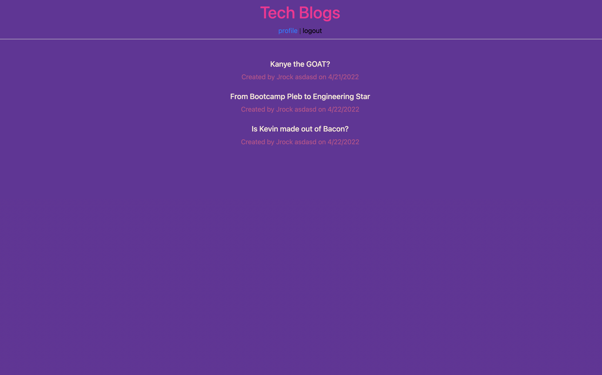

# Tech Blog

## Description

This project showcases the use of the MVC model used in programming. The Tech Blog itself is a website where you can post/delete topics, create comments, and update posts all from a bcrypt encrypted server using mySQL and JAWS on Heroku. 

## Technologies Used

-   Javascript
-   HTML
-   Node.js
-   Express.js
-   CSS
-   Heroku
-   Handlebars
-   mySQL

## Screenshot

## Links to Application

-   Here is the repo: [Jon's Tech Blog Repo](https://github.com/Jonchirinos/tech-blog)
-   Here is the Heroku App Page: [Jon's Tech Blog App] (https://techblog-jc714.herokuapp.com/)
